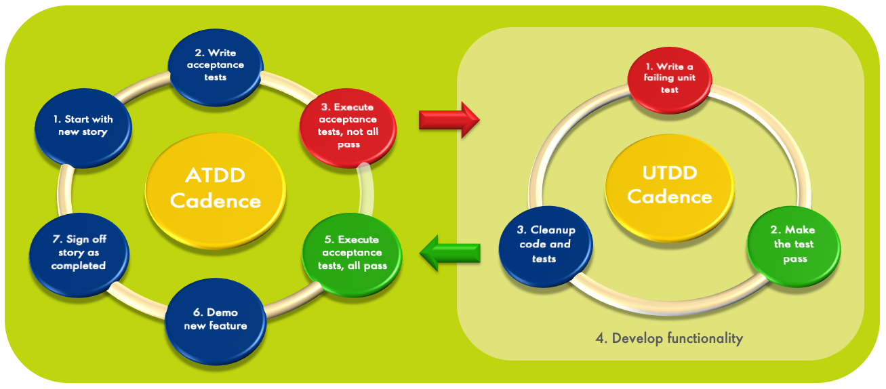
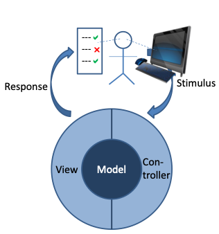
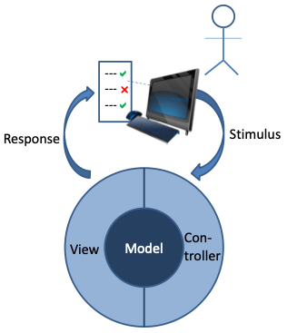
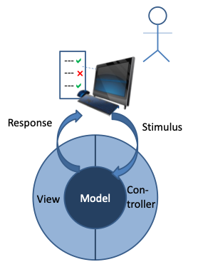
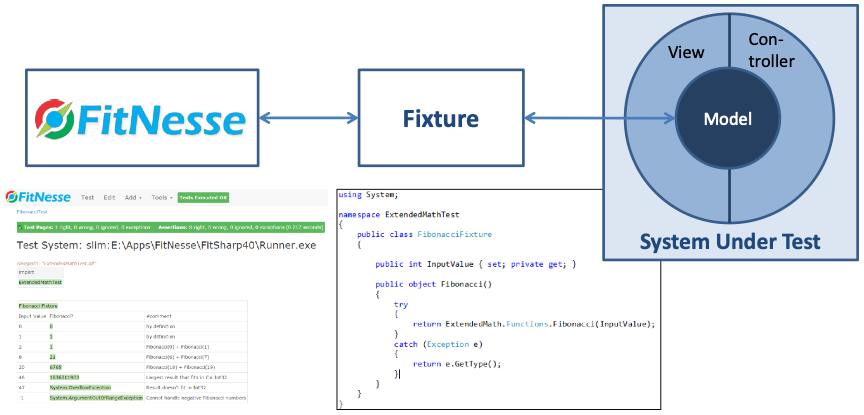

# Introduction

## What is Functional Testing?

Functional testing is validating if the functional requirements of a system are met. In other words, does the system function as the business expected it to do? Does the system give the right answers? It does not cover non-functional aspects as performance, security, reliability, etc. Functional testing is also known as black box testing, i.e. it tests the functionality without looking at the inner workings of the system under test. This contrasts with glass box testing (a.k.a. white box testing) where the structure and logic of the code are considered.

Traditionally, functional testing has been done via the application’s user interface (UI). Testers just use the system as if they are end users, and execute their test cases by following scripts that are designed to try and uncover flaws. The figure right shows where the interaction takes place in a model-view-controller (MVC) architecture, which is a good way to separate business logic from UI code. For more details on MVC see the [Wikipedia article](https://en.wikipedia.org/wiki/Model%E2%80%93view%E2%80%93controller) on the topic. The tester presents a stimulus to the system, which is handled by the controller, and the response is shown to the tester via a view. Then the tester checks whether the system responds as expected.

##	Why Automating Functional Testing?

The problem with manual testing is that it is very tedious and labor-intensive work – you need to execute the same activities repeatedly. In Lean terms, it is often a waste of human intellect. Furthermore, with the world going more and more towards agile forms of development such as Scrum, manual testing is no longer feasible. After all, each sprint should result in a releasable product increment, so it should also be fully tested, at least up to system test level. With sprint cycles of a few weeks at most, there is just not enough time to do everything by hand. 
Additionally, people are usually not very good at executing repetitive tasks, and many people dislike it. They get bored, distracted, or get into an ‘automatic pilot’ mode without much thinking, and may miss defects that way.

Automating functional tests allows teams to spend the available human intellect on designing good test cases, and execute these automatically as frequently as needed. Machines don’t get bored or distracted and are good at executing repetitive tasks accurately. As an additional benefit, automated testing enables continuous delivery scenarios, where a check-in triggers a fully automated sequence of build, unit testing, deployment to a test environment, functional testing, non-functional testing, and, if all is successful, deployment to production.

## Support for Acceptance Test Driven Development
So far, we have been focusing on the test side of the software development process. Acceptance Test Driven Development (ATDD) goes a step further: you create acceptance test cases before you start developing. This helps you to eliminate ambiguity in your requirements, which in turn will help you to reduce the number of requirements defects (which tend to be expensive to correct). Essentially, you describe the requirements for your user story in test case language. The figure below shows the principle.

As the picture shows, there is a relationship with (Unit) Test Driven Development (TDD), but ATDD is not the same as TDD. TDD is executed at the development task level, and has very short cycles (minutes at most). You create a failing unit test, make it pass, refactor the code to adhere to the definition of done, and start the next cycle. This allows you to achieve a very high test coverage level, and you almost continuously have running code. Furthermore, it helps ensure that you won’t build code that is not needed. Because of its focus on the unit test level, the more explicit term UTDD (Unit Test Driven Development) becomes increasing popular as well.
ATDD on the other hand is executed at the user story level. It ensures that when you start working on a story, you get a clearer view on what exactly you need to build. You achieve consensus with the product owner about that via a set of test cases that need to pass before the story can be accepted. 
It makes sense to combine the two approaches, but ATDD can also be done with a more traditional development approach. Note that ATDD doesn’t guarantee that the test cases are a complete representation of the requirements. Test coverage techniques as described in Chapter 6 can help in that aspect. 
Another advantage of ATDD is that you incrementally build up a set of test cases that you can use for regression testing: when I deliver the next story, do the results of all my previous stories still work?
You can do ATDD without test automation, but that would be cumbersome as you want to be able to run these tests often. So, it easily becomes prohibitively expensive to do this manually. A tool supporting ATDD will need to allow collaboration between business-oriented people (product owners, business analysts and domain experts), developers and testers. It must also be possible to specify test cases when there is nothing to be run yet.

## Test Automation Strategy

We have now established that it often makes sense to automate our tests, and to take test auto-mation one step further and implement ATDD. What should the strategy be like to get this in place?

Many test automation projects take the approach of simply automating the process that testers execute manually like-for-like, e.g. by using record-and-playback tools to emulate the user. For example, in Microsoft Test Manager (see MSDN) you can enter the scripts, and specify multiple sets of data to run the script on. You show the system what should be done with the first data row (you map the script to UI activities), and the system will execute the steps that you showed for next data rows. The tester only needs to verify the correct response for each data row. The adjacent figure shows the idea. The benefit of this approach is often marginal since it requires manual intervention, and the test cases are quite maintenance intensive. The user interface tends to be the most volatile part of an application: it changes a lot during the application’s lifetime. And every time that the user interface changes, the test case may need to change as well.

Several test automation tools address the issue of manual intervention by allowing you to automate the response verification as well, as shown in the figure below right. This is how many commercial test automation tools work. Drawbacks are: 

1. Test automation done this way tends to be brittle. If the recording capability is not sufficient for your needs, you will need to modify the generated code. This requires development skills. UI changes are amongst the most frequent changes in an application, and for every one of those you may either need to re-generate the test code and re-apply your changes, or alternatively manually code the changes. So, the maintenance effort associated with test automation done this way can be considerable, and may even outweigh the benefits in terms of reduced test execution effort. 

2. Accessing applications via the UI is slow. That usually doesn’t matter for human beings, because sub-second response times (an even occasional slower responses) per interaction are generally fast enough for them. However, if your check-in is dependent on a successfully executed automated build and test run, then a set of several hundred tests that each take a few seconds is far from fast enough – you don’t want to wait half an hour or more with every check-in. Furthermore, simulating a user requires interactive access to a machine by a non-personal account, which may be a security concern in corporate environments. 

When validating that the business model is correct, tests can be made much more stable by using the application programming interface (API) level to call the relevant business logic functions.

In the Model-View-Controller pattern shown above, you bypass the view and the controller, and directly access the model. Since these APIs are considerably more stable than the UI, it is less likely that they need to change. And calling an API is much faster than simulating a user. Calling APIs is not limited to directly executing methods on objects; you can also think about testing of [REST](https://en.wikipedia.org/wiki/Representational_state_transfer) (Representational State Transfer) and [GraphQL](https://graphql.org/) web services. Strictly speaking these have a very thin view and controller layer (there can be differences between the model API and the REST/GraphQL API), but they are much closer to the model APIs than the UI is.

The goal should be to cover all functional tests at the API level. If the application under test is properly designed (e.g. using a model-view-controller or model-view-presenter pattern), you can test the complete business logic by just stimulating the business model via APIs. 

Unfortunately, this use case is typically not supported very well in test automation tools, so many teams resort to coding these tests in e.g. unit testing frameworks, and exposing the testers to the data structure in some way. So it requires either a lot of boiler plate work to make this usable for testers who don't use IDEs, or testers to start using developent tooling. Also, the tests are quite static – if the test case does not do exactly what you want, you would have to write another one. 

## FitNesse: Acceptance Testing at API Level
The open source community has realized the lack of affordable and tester-friendly functional testing tools on API level as well. In the early 2000s, Ward Cunningham created [Fit](http://fit.c2.com/), which allowed for execution of HTML tables via fixtures, and somewhat later Robert C. Martin (“Uncle Bob”) and his son Micah built on that and created [FitNesse](http://www.fitnesse.org/), which focuses on automated acceptance testing.  While FitNesse was originally targeted at Java development, it is possible to use it with all kinds of languages including but not limited to .Net code (C#, F#, Visual Basic), C, C++, Ruby, Python, Go, and PowerShell.

As can be read in the [Acceptance Tests page](http://fitnesse.org/FitNesse.UserGuide.AcceptanceTests) of the FitNesse user guide:

“FitNesse automated acceptance tests have several advantages over many kinds of traditional black-box, GUI-based functional tests:
* FitNesse tests can give us feature feedback **very early** in the project. In fact, the tests ought to be written **first**, so programmers can code to the tests.
* FitNesse tests can give us feature feedback **very frequently**. They can be run manually or automatically by anyone with web access to the server, as frequently as required. Every week, every day, every hour in a crunch.
* FitNesse tests are **deterministic**: they either run green or red. If they run green for a given requirement, either the requirement is done and we move on to others, or the set of tests is not yet exactly right, in which case we refine them. Either way, we are **successively refining** the system in an orderly way. With each new test running green, we can all see the system getting better, more valuable, closer to what we need.
* Being based on example data, FitNesse tests **exercise more paths through the business logic**. When you use FitNesse, you run less risk of missing important features or functional behavior.”

FitNesse allows testers to create their functional tests in a Wiki environment. The strategy is specification by example. The simplest form of a test is a table with input values and expected output values, but there are many more options. When you run the test, FitNesse executes the tests and compares whether the real result matches the expected result

In the bottom left of the figure you see a wiki page. It is too small to fully read, but we will see many of them later. A fixture, shown in the middle, is a simple piece of wrapper code of a prescribed structure that just calls APIs of the system under test. FitNesse translates the names of input and output columns to properties and methods in the fixture, and can so figure out how to ‘run’ the table, thereby executing the tests. 

A significant difference with using a unit test framework is that FitNesse provides a more collaborative approach to test case specification, and it provides more control for the test designers without requiring development expertise. They can design the test, not just the test data. Since the test development environment is a Wiki, it has a less steep learning curve than other testing tools tend to have. And since the pages are Wikis, you can add any additional information you like, e.g. an explanation why certain test cases are important. From the developer’s side, all they need to do is develop a simple fixture, which can be re-used over and over – there is no need to code all individual tests.

## FitSharp: .NET Test Runner for FitNesse
Historically FitNesse was focused on the Java world. FitNesse itself is written in Java, and its own acceptance test cases have Java fixtures. But we also want to be able to test Microsoft .Net applications written in C#, and preferably write the fixtures for these applications in C# as well. Fortunately, FitNesse was written with extensibility in mind. 

Originally, FitNesse only supported the Fit protocol which had some portability issues. With the introduction of the SLIM (Simple List Invocation Method) protocol, porting test runners became a lot easier. Also, SLIM uses more lightweight fixture classes. Test runners for many languages have been developed, e.g. C, PowerShell, PHP, C# and Go. The test runner for C# is called FitSharp. It supports both Fit and SLIM, but we focus our efforts on the newer one of the two: SLIM. The main reason is that it is simpler to write fixtures for SLIM. Primarily, it works with plain objects, while with Fit you need to inherit from Fit fixture classes. This makes SLIM fixtures more flexible, and unlike FIT fixtures they don’t have a dependency on a FitSharp assembly.

## Is There Still a Place for Automated UI Testing?
This page explained why you should not focus your automated testing efforts too much on the UI. However, it may still also make sense to automate tests at the UI level, but that should be a relatively small set of tests which only test the user interface and not the functionality. Whether this will be worthwhile is a matter of economics: if you need to run the tests very often (e.g. as part of the regression tests in each sprint in a Scrum project) or in very many configurations, then automation of UI tests will be economically viable because the effort required for manual testing will quickly become prohibitive. If we are talking about a few tests that need to be executed once a year, then the investment in automating UI tests may not pay off. 

If you do decide to invest in test automation at the UI level, then it makes sense to keep the number of UI tests small. Then, the maintenance work to keep them up and running will be limited. There are other measures to minimize test maintenance work, such as ensuring that all UI elements that need to be accessed have unique and constant identifiers. This makes the tests much more maintainable, as things like moving elements elsewhere on the screen will not have impact on finding them; so the test cases will tolerate many cosmetic changes. It becomes a lot more brittle if the locators are based on the exact location of an element (e.g. give me the element at location x=23, y=84) or the UI structure (e.g. give me the second element in the third grouping on the page). But even then, maintainability can be improved by defining those locators only once (e.g. in a variable) instead of repeatedly using them in test scripts – as developers know, Don’t Repeat Yourself (DRY principle). 

FitNesse is a very useful tool to support automated UI testing. The trick to reduce maintainability concerns is to create standard fixtures that provides building blocks, hiding the complexity of simulating a user. That way, you can have FitNesse manage the scenarios with all the good features that FitNesse provides. This allows testers to focus on creating scenarios that are most likely to reveal defects, while they don’t have to be concerned about the low-level interaction with the browser. Similarly, a fixture can be created to hide the complexity of driving thick client applications.
