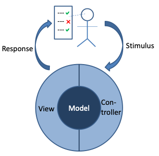

# Acceptance Testing and Test Automation with FitNesse and FitSharp

This site is about functional test automation in the .Net environment with the FitNesse automated acceptance testing framework. Historically, FitNesse has been mainly used to test Java applications since FitNesse itself is a Java application. However, it is also very well possible to test .Net applications with it, and this site will show how. 

## What is Functional Testing?

Functional testing is validating if the functional requirements of a system are met. In other words, does the system function as the business expected it to do? Does the system give the right answers? It does not cover non-functional aspects as performance, security, reliability, etc. Functional testing is also known as black box testing, i.e. it tests the functionality without looking at the inner workings of the system under test. This contrasts with glass box testing (a.k.a. white box testing) where the structure and logic of the code are considered.

Traditionally, functional testing has been done via the application’s user interface (UI). Testers just use the system as if they are end users, and execute their test cases by following scripts that are designed to try and uncover flaws. The figure below shows where the interaction takes place in a model-view-controller (MVC) architecture, which is a good way to separate business logic from UI code. For more details on MVC see the [Wikipedia article](https://en.wikipedia.org/wiki/Model%E2%80%93view%E2%80%93controller) on the topic. The tester presents a stimulus to the system, which is handled by the controller, and the response is shown to the tester via a view. Then the tester checks whether the system responds as expected.

##	Why Automating Functional Testing?

The problem with manual testing is that it is very tedious and labor-intensive work – you need to execute the same activities repeatedly. In Lean terms, it is often a waste of human intellect. Furthermore, with the world going more and more towards agile forms of development such as Scrum, manual testing is no longer feasible. After all, each sprint should result in a releasable product increment, so it should also be fully tested, at least up to system test level. With sprint cycles of a few weeks at most, there is just not enough time to do everything by hand. 
Additionally, people are usually not very good at executing repetitive tasks, and many people dislike it. They get bored, distracted, or get into an ‘automatic pilot’ mode without much thinking, and may miss defects that way.

Automating functional tests allows teams to spend the available human intellect on designing good test cases, and execute these automatically as frequently as needed. Machines don’t get bored or distracted and are good at executing repetitive tasks accurately. As an additional benefit, automated testing enables continuous delivery scenarios, where a check-in triggers a fully automated sequence of build, unit testing, deployment to a test environment, functional testing, non-functional testing, and, if all is successful, deployment to production.
